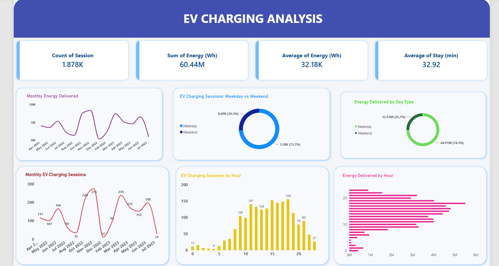

# ⚡ EV Charging Analytics Dashboard

An end-to-end data analytics project that analyzes **1,878 real EV charging sessions** to understand charging demand, energy delivery, session duration, and operational patterns.

The project follows a complete analytics workflow:

> **Raw Excel Data → Data Cleaning & EDA in Python → SQL Analysis → Power BI Dashboard → Business Insights**

---

## 🖥️ Power BI Dashboard



The interactive dashboard provides insights into:

- Total charging sessions
- Total energy delivered
- Average energy delivered per session
- Average session duration
- Monthly charging trends
- Monthly energy delivery
- Hourly charging demand
- Hourly energy delivery
- Weekday vs weekend charging patterns

---

## 🎯 Project Objective

The objective of this project is to transform raw EV charging session data into meaningful operational insights.

The analysis helps answer questions such as:

1. How many EV charging sessions were recorded?
2. How much energy was delivered?
3. When is charging demand highest?
4. How does charging activity vary by hour and month?
5. Are weekdays busier than weekends?
6. How much energy is delivered per charging session?
7. How long do charging sessions typically last?
8. How does energy delivery change throughout the day?
9. Which connector is used most frequently?
10. What insights can support EV charging infrastructure planning?

---

## 📊 Key KPIs

| KPI | Result |
|---|---:|
| Total Charging Sessions | **1,878** |
| Total Energy Delivered | **60,441.94 kWh** |
| Average Energy per Session | **32.18 kWh** |
| Average Session Duration | **32.92 minutes** |
| Peak Charging Hour | **18:00** |
| Sessions at Peak Hour | **156** |
| Weekday Sessions | **1,384 (73.7%)** |
| Weekend Sessions | **494 (26.3%)** |
| Most Used Connector | **CCS1** |
| CCS1 Sessions | **1,129** |
| Average Maximum Charging Power | **102.49 kW** |

---

## 📁 Dataset

The dataset contains **1,878 EV charging sessions** recorded between:

- **First Session:** April 12, 2022
- **Last Session:** July 4, 2023

The original dataset contains **14 columns**:

- `Session`
- `CCS`
- `Arrival`
- `Departure`
- `Stay (min)`
- `Energy (Wh)`
- `Pmax (W)`
- `Preq_max (W)`
- `Controlled session (0=False, 1=True)`
- `TotalCapacity`
- `BulkCapacity`
- `SOC arrival`
- `SOC departure`
- `Energy capacity (Wh)`

### Data Quality Checks

| Metric | Result |
|---|---:|
| Rows | **1,878** |
| Columns | **14** |
| Missing Values | **0** |
| Duplicate Rows | **0** |

---

## 🛠️ Tools & Technologies

- **Python**
- **Pandas**
- **NumPy**
- **Matplotlib**
- **SQL**
- **Power BI**
- **Excel**
- **Git**
- **GitHub**

---

# 🔄 Project Workflow

## 1️⃣ Data Preparation

The raw dataset was analyzed and prepared using **Python and Pandas**.

The data preparation process included:

- Inspecting dataset structure and data types
- Checking for missing values
- Detecting duplicate records
- Converting datetime fields
- Extracting the charging hour
- Extracting month and year
- Creating weekday/weekend categories
- Creating session-duration categories
- Converting energy values from Wh to kWh

---

## 2️⃣ Exploratory Data Analysis with Python

Python was used to perform exploratory data analysis and calculate operational KPIs.

The analysis examined:

- Charging sessions by hour
- Monthly charging sessions
- Energy delivery
- Session duration
- Weekday vs weekend charging behavior
- Energy distribution
- Maximum charging power

### Python Visualizations

The project includes:

- Charging Sessions by Hour
- Monthly Charging Sessions
- Weekday vs Weekend Sessions
- Energy Distribution
- Session Duration Distribution
- Average Energy by Day Type

The Python analysis notebook is available in:

```text
notebooks/ev_charging_analysis.ipynb
